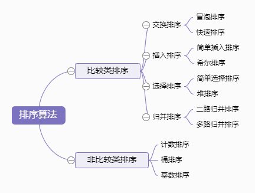
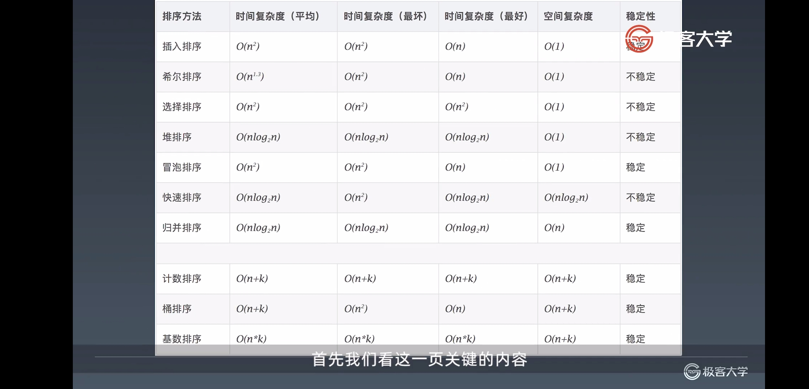

### 学习笔记

#### 指定位置的位运算

1. 将x最右边的n位清零：x  & (~0 << n)
2. 获取x的第n位值(0或者1)：(x >> n) & 1
3. 获取x的第n位的幂值：x & (1 << n)
4. 仅将第n位置为1：x | (1 << n)
5. 仅将第n位置为0：x & (~(1 << n))
6. 将x最高位至第n位(含)清零：x & ((1 << n) - 1)

#### 实战位运算要点

- 判断奇偶：

    x % 2 == 1 --> (x & 1) == 1

    x % 2 == 0 --> (x & 1) == 0

- x >> 1 --> x / 2

    即： x = x / 2; --> x = x >> 1;

    mid = (left + right) / 2;  --> mid = (left + right) >> 1;


- x = x & (x - 1) 清零最低位的1

- x & -x =>得到最低位的1

- x&~x => 0

#### N皇后的位运算解法-Python


```python
def totalNQueens(self, n) :
    if n < 1: return []
    self.count = 0
    self.DFS(n,0,0,0,0)
    return self.count

def DFS(self, n, row, cols, pie, na):
    # recursion terminator
    if row >= n:
        self.count += 1
        return

    bits = (~(cols | pie |na)) & ((1 << n ) - 1)  # 得到当前所有的空位

    while bits:
        p = bits & bits # 取到最低位的1
        bits = bits & (bits - 1) # 表示在p位置上放入皇后
        self.DFS(n, row * 1, cols | p, (pie | p) << 1, (na | p) >> 1)
        # 不需要revert cols, pie, na 的状态
```

```java
class Solution{
    private int size;
    private int count;

    private void solve(int row, int ld, int rd) {
        if (row == size) {
            count++;
            return;
        }
        int pos = size & (-(row | ld |rd));
        while (pos != 0) {
            int p = pos & (-pos);
            pos -= p; //pos &= pos - 1;
            slove(row | p, (ld | p) << 1, (rd | p) >> 1);
        }
    }

    public int totaoNQuees(int n) {
        count = 0;
        size = (1 << n) - 1;
        slove(0,0,0);
        return count;
    }
}
```

#### Bloom Filter vs Hash Table

一个很长的二进制向量和一系列随即映射函数。 布隆过滤器可以用于检索一个元素是否在一个集合中。

优点是空间效率和查询时间都远远超过一般算法，

缺点是有一定的误识别率和删除困难。

python 实现

```python
from bitarray import bitarray
import mmh3

class BloomFilter:
    def __init__(self, size, hash_num):
        self.size = size
        self.hash_num = hash_num
        self.bit_array = bitarray(size)
        self.bit_array.setall(0)

    def add(self, s):
        for seed in range(self.hash_num):
            result = mmh3.hash(s, seed) % self.size
            self.bit_array[result] = 1
    def lookup(self, s):
        for seed in range(self.hash_num):
            result = mmh3.hash(s, seed) % self.size
            if self.bit_array[result] == 0:
                return "Nope"
        return "Probably"

bf = BloomFilter(500000, 7)
bf.add("dantezhao")
print(bf.lookup("dantezhao"))
print(bf.lookuo("yyj"))
```

#### LRU Cache

- 两个要素： 大小、 替换策略

- Hash Table + Double LinkedList

- O(1) 查询

- O(n) 修改、更新

#### 替换策略

- LFU - least frequently used

- LRU - least recently used

替换算法总览：

https://en.wikipedia.org/wiki/Cache_replacement_policies

```python
class LRUCache (object) :

    def __init__(self, capacity):
        self.dic = collections.OrderedDict()
        self.remain = capacity

    def get(self, key):
        if key not in self.dic:
            return -1;
        v = self.dic.pop(key)
        self.dic[key] = v # key as the newest one
        return v

    def put (self, key, value):
        if key in self.dic:
            self.dic.pop(key)
        else:
            if self.remain > 0:
                self.remain -= 1
            else: # self.dic is full
                self.dic.popitem(last = False)
        self.dic[key] = value
```

```java
public class LRUCache {
    private Map<Integer, Integer> map;

    public LRUCache (int capacity) {
        map = new LinkedCappedHashMap<>{capacity};
    }

    public int get(int key) {
        if (!map.containsKey(key)) {return -1;}
        return map.get(key);
    }

    public void put (int key, int value) {
        map.put(key, value);
    }

    private static class LinkedCappedHahsMap<K, V> extends LinkedHashMap<K,V> {
        int maximumCapacity;

        LinkedCappedHashMap (int maximumCapacity) {
            super (16, 0.75f, true);
            this.maximumCapacity = maximumCapacity;
        }

        protected boolean removeEldestEntry (Map.Entry eldest) {
            return size() > maximumCapacity;
        }
    }
}

```

####  排序算法

1. 比较类排序：

    通过比较来决定元素间的相对次序，由于其时间复杂度不能突破O(nlogn)，因此也成为非线性时间比较类排序。

2. 非比较类排序：
    
    不通过比较来决定元素间的相对次序，它可以突破基于比较排序的时间下界，以线性时间运行，因此也成为线性时间非比较类排序。






#### 初级排序 - O(n^2)

1. 选择排序

    每次找最小值，然后放到待排序数组的起始位置。

2. 插入排序

    从前到后逐步构建有序序列；对于未排序数据，在已排序序列中从后向前扫描，找到相应位置并插入。

3. 冒泡排序

    嵌套循环，每次查看相邻的元素如果逆序，则交换。


快排代码 - Java

```java

public static void quickSort(int[] array, int begin, int end) {
    if(end <= begin) return;

    int pivot = partition(array, begin, end);
    quickSort(array, begin, pivot - 1);
    quickSort(array, pivot + 1, end);
}

static int partition(int[] a, int begin, int end) {
    // pivot: 标杆位置，counter: 小于pivot的元素的个数
    int pivot = end, counter = begin;

    for (int i = begin; i < end; i++) {
        if (a[i] < a[pivot]) {
            int temp = a[counter]; a[counter] = a[i]; a[i] = temp;
            count++;
        }
    }

    int temp = a[pivot]; a[pivot] = a[counter]; a[counter] = temp;
    return counter;
}
```

调用方式：quickSort(a, 0, a.length - 1)


#### 高级排序 -O(N * LogN)

- 归并排序 (Merge Sort) - 分治

1. 把长度为n的输入序列分成两个长度为你n/2的子序列；
2. 对这两个子序列分别采用归并排序；
3. 将两个排序好的子序列合并成一个最终的排序序列。


归并排序代码 JAVA

```java
public static void mergeSort(int[] array, int left, int right) {
    if (right <= left) return;
    int mid = (left + right) >> 1; // (left + right) / 2

    mergeSort(array, left, mid);
    mergeSort(array, mid + 1; right);
    merge(array, left, mid, right);
}

public static void merge(int[] arr, int left, int mid, int right) {
    int[] temp = new int[right - left + 1]; //中间数组
    int i = left, j = mid + 1, k = 0;

    while(i <= mid && j <= right) {
        temp[k++] = arr[i] <= arr[j] ? arr[i++] : arr[j++];
    }

    while(i <= mid) temp[k++] = arr[i++];
    while(j <= right) temp[k++] = arr[j++];

    for (int p = 0; p < temp.length; p++) {
        arr[left + p] = temp[p];
    }

    // 也可以用System.arraycopy(a, start1, b, start2, length)
}
```

归并和快排具有相似性，但步骤顺序相反

归并：先排序左右子数组，然后合并两个有序子数组

快排：先调配出左右子数组， 然后对于左右子数组进行排序

- 堆排序----堆插入O(logN), 取最大/小值O(1)

1. 数组元素依次建立小顶堆
2. 依次取堆顶元素，并删除

堆排序代码 C++

```c++
void heap_sort(int a[], int len) {
    priority_queue<int, vector<int>, greater<int> > q;
    for(int i = 0; i < len; i++) {
        q.push(a[i]);
    }

    for(int i = 0; i < len; i++) {
        a[i] = q.pop();
    }
}

static void heapify(int[] array, int length, int i) {
    int left = 2*i + 1, right = 2 * i + 2;
    int largest = i;

    if (left < length && array[left] > array[largest] ) {
        largest = leftChild;
    }
    if (right < length && array[right] > array[largest]) {
        largest = right;
    }

    if (largest != i) {
        int temp = array[i]; array[i] = ayyay[largest]; array[largest] = temp;
        heapify(array, length, largest);

    }
}

public static void heapSort(int[] array) {
    if (array.length == 0) return;

    int length = array.length;
    for (int i = length / 2-1; i >= 0; i-) {
        heapify(array, length, i);
    }

    for (int i = length - 1; i >= 0; i--) {
        int temp = array[0]; array[0] = array[i]; array[i] = temp;
        heapify(array, i, 0);
    }
}
```

#### 特殊排序

- 计数排序：

    计数排序要求输入的数据必须是有确定范围的整数。将输入的数据值转化为键存储在额外开辟的数组空间中；然后依次把计数大于1的填充回原数组

- 桶排序

    桶排序的工作原理：假设输入数据服从均匀分布，将数据分到有限数量的桶里，每个桶再分别排序(有可能再使用别的排序算法或是以递归方式继续使用桶排序进行排序)


- 基数排序

    基数排序是按照低位先排序，然后收集； 再按照高位排序， 然后再收集；依次类推，直到最高位。有时候有些属性是有优先级顺序的，先按低优先级排序，再高优先级排序。


